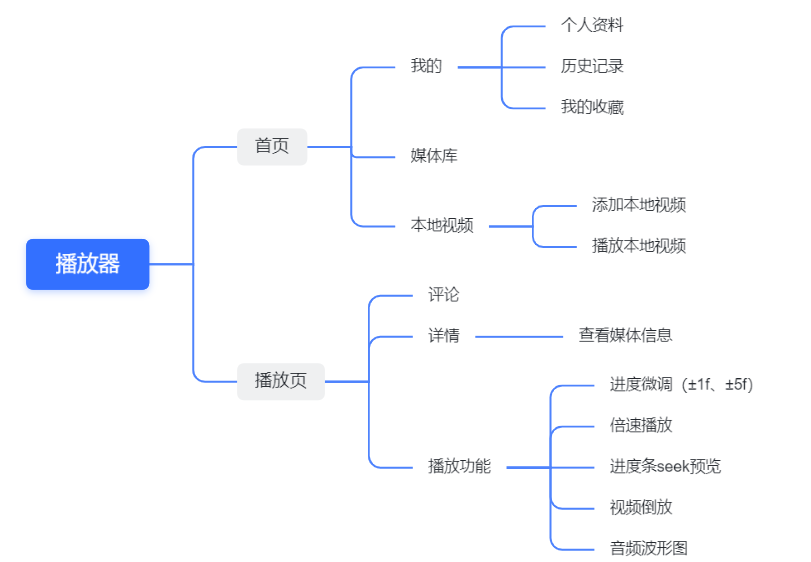

# 音视频播放器需求规格说明书

## 变更记录

| **序号** | **变更日期** | 版本   | 变更位置 | 变更原因 | 修订人  | 审核人  | 批准人  |
| ------ | -------- | ---- | ---- | ---- | ---- | ---- | ---- |
| 1      |          |      |      |      |      |      |      |
|        |          |      |      |      |      |      |      |
|        |          |      |      |      |      |      |      |
|        |          |      |      |      |      |      |      |

## 项目介绍

### 项目说明

项目名称：XX音视频播放器。

任务提出者：字节跳动剪映团队。

开发者：慢播小组。

### 项目背景

### 项目目标

以用户喜好为一切

## 需求说明

### 整体需求

该播放器支持主流音频、视频的播放，用户能根据自己的喜好添加本地视频，播放本地或在线视频......

### 整体模块划分

主要分为两大模块：首页、播放页

## 功能性需求(需求详情)

### 首页模块相关功能

首页模块由三部分组成：媒体库、我的、本地视频

#### 本地视频

本地视频功能包括添加本地视频和播放本地视频。

1. 添加本地视频：

通过视频所在路径查询到相应视频，并且添加到播放器中

2. 播放本地视频：

- 添加到播放器后的视频可以在播放器中播放，此外，播放器可以记录历史观看。
- 添加到播放器后的视频可以根据用户所选择的排序方式进行排序，例如按照添加时间排序、按照名称排序等等。
- 支持对已添加的本地视频列表进行搜索。

### 媒体库

- 分类功能：可以根据视频类型、所属地区、视频年份对视频进行筛选。并且可以根据最新(视频发布时间)或最热(视频播放量)对筛选的视频进行排序展示。
- 用户选择完合适的类别后，筛选的视频显示在分类下方，点击视频即可跳转到播放页对视频进行播放。

#### 我的

我的模块即为与用户行为息息相关的模块，主要分为个人资料、历史记录，我的收藏三部分。

**个人资料**

- 对昵称、头像、密码、个人简介进行修改的功能。
- 注销账号或者登陆账号的功能。
- 更新播放器版本。

**历史记录** 

对用户的观看历史进行记录，并且根据用户观看时间对历史观看视频进行排序。同样也支持对历史观看视频列表进行搜索的功能。

**我的收藏** 

- 用户可以创建收藏夹、并且可以更改收藏夹名称。
- 各个收藏夹分别展示用户所收藏的视频，并且支持在对应收藏夹中进行搜索的操作。
- 收藏夹中视频根据收藏时间进行排序。

### 播放页模块相关功能

#### 评论

支持用户对正在播放的音视频进行评论，并向所有用户显示该条评论的产生时间及评写用户的用户名；用户能够对其他用户在该音视频下的评论进行点赞；全部用户评论可按照评论时间从近到远或按照点赞数目从多到少对全部用户评论进行排序。

#### 详情

播放界面显示当前播放的音视频的名称及其所属类别；点击内容简介可查看当前音视频的作者及发布时间，以及视频内容的大概描述(如果作者有备注)。

#### 播放功能

1.进度微调。播放器播放音视频时有微调进度选项，可以选择前进、倒退1s或前进、倒退5s。

2.倍速播放。播放器播放音视频时可选择倍速播放，并有多个速率调节，如0.5x、1.25x、2.0x等。

3.进度条seek预览。播放器支持拖动进度条，当拖动视频进度时，显示当前时间的动画帧，当鼠标停顿时，显示当前动画帧。

4.视频倒放。播放器支持视频倒放模式选择，从视频结尾开始倒放，并可拖动进度条，同样显示动画帧。

5.音频波形图。播放器支持显示音乐的实时音频波形图。